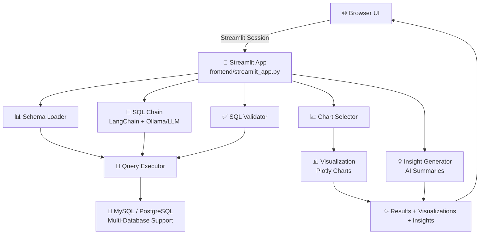
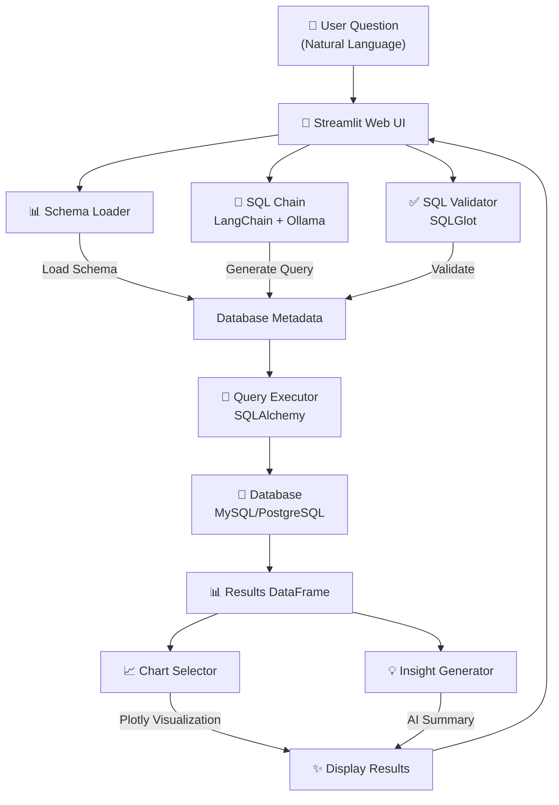

# 📊 IntelliSQL AI

> **Stop writing SQL. Start asking questions.**
> 
> Convert natural language questions into intelligent SQL queries, get results, visualizations, and AI-powered insights—all in seconds.

---

## 🚀 What is IntelliSQL AI?

IntelliSQL AI is an intelligent SQL analytics platform that bridges the gap between human language and databases. Ask questions in plain English, and let AI handle the SQL complexity.

### ✨ Key Features

- **🤖 AI-Powered Query Generation** — Ask questions in plain English; IntelliSQL generates optimized SQL automatically
- **📈 Auto-Visualization** — Intelligently detects the best chart type for your data
- **💡 AI Insights** — Generates natural language summaries and insights from your results
- **✅ SQL Validation** — Built-in validation ensures queries are safe and efficient
- **🗄️ Multi-Database Support** — Works seamlessly with multiple databases
- **📊 Query History** — Track and manage all your queries for future reference
- **🎯 Schema-Aware** — Understands your database structure for accurate query generation

---

## 🏗️ Project Architecture

IntelliSQL AI follows a modular, clean architecture designed for scalability and maintainability:

### System Architecture Diagram



### Project Structure

```
IntelliSQL AI/
├── app/                          # Backend logic
│   ├── chains/                   # LangChain workflows
│   │   └── sql_chain.py          # NL → SQL conversion pipeline
│   ├── database/                 # Database operations
│   │   ├── schema_loader.py      # Load database schemas
│   │   ├── query_executor.py     # Execute SQL queries
│   │   └── database_manager.py   # Multi-database support
│   ├── llm/                      # LLM integrations
│   │   └── [LLM providers]       # Ollama, OpenAI, etc.
│   ├── services/                 # Business logic
│   │   ├── sql_validator.py      # Validate & sanitize SQL
│   │   ├── chart_selector.py     # Auto-detect visualization type
│   │   ├── insight_generator.py  # Generate AI insights
│   │   └── query_history.py      # Store & retrieve queries
│   └── main.py                   # CLI entry point
├── frontend/                      # Web UI (Streamlit)
│   ├── streamlit_app.py          # Main web app
│   ├── pages/                    # Multi-page app pages
│   └── components/               # Reusable UI components
│       └── charts.py             # Chart rendering
├── tests/                        # Test suite
├── data/                         # Sample data & configs
├── requirements.txt              # Python dependencies
└── .env                          # Environment variables
```

### 🔄 Data Flow



### 🧩 Core Components

| Component | Purpose | Tech Stack |
|-----------|---------|-----------|
| **SQL Chain** | Converts natural language to SQL | LangChain + Ollama/OpenAI |
| **Schema Loader** | Fetches database metadata | SQLAlchemy |
| **Query Executor** | Runs SQL safely | SQLAlchemy + PyMySQL |
| **Validator** | Ensures query correctness | SQLGlot |
| **Chart Selector** | Picks optimal visualization | Plotly + ML logic |
| **Insight Generator** | Summarizes results in English | LLM |
| **Web UI** | Interactive dashboard | Streamlit |

---

## 📋 Prerequisites

Before you start, make sure you have:

- **Python 3.9+** installed
- **pip** (Python package manager)
- **MySQL/PostgreSQL** (or any SQLAlchemy-compatible database)
- **Ollama** or an OpenAI API key (for LLM functionality)
- **Git** (for cloning the repository)

---

## ⚙️ Setup Instructions

### 1️⃣ Clone the Repository

```bash
git clone https://github.com/yourusername/IntelliSQL-AI.git
cd IntelliSQL-AI
```

### 2️⃣ Create a Virtual Environment

```bash
# Create virtual environment
python -m venv .venv

# Activate it
# On Windows:
.venv\Scripts\activate
# On macOS/Linux:
source .venv/bin/activate
```

### 3️⃣ Install Dependencies

```bash
pip install -r requirements.txt
```

### 4️⃣ Configure Environment Variables

Create a `.env` file in the project root:

```env
# Database Configuration
DB_HOST=localhost
DB_USER=your_db_user
DB_PASSWORD=your_db_password
DB_NAME=your_database
DB_PORT=3306
DB_TYPE=mysql  # or postgresql, sqlite, etc.

# LLM Configuration (choose one)
# For Ollama (local):
OLLAMA_BASE_URL=http://localhost:11434
LLM_MODEL=mistral  # or llama2, neural-chat, etc.

# OR for OpenAI:
OPENAI_API_KEY=your_openai_key
LLM_MODEL=gpt-4  # or gpt-3.5-turbo

# Optional: Query logging
ENABLE_HISTORY=true
HISTORY_DB=sqlite:///query_history.db
```

### 5️⃣ Prepare Your Database

Ensure your database is running and accessible. The schema will be auto-loaded.

**Optional:** Load sample data for testing:
```bash
# If you have sample SQL scripts in the data/ folder
mysql -u your_user -p your_database < data/sample_data.sql
```

---

## 🎯 Quick Start

### Web UI (Streamlit) - Recommended ⭐

```bash
# Start the Streamlit app
streamlit run frontend/streamlit_app.py
```

Open your browser at `http://localhost:8501` and start asking questions!

### CLI Interface (Alternative)

```bash
# Run the CLI version
python -m app.main
```

Follow the prompts to enter your questions.

---

## 💡 Usage Examples

### Web UI Example
1. Open the app in your browser
2. Select your database from the sidebar
3. Type: *"Show me the top 10 customers by revenue in the last quarter"*
4. IntelliSQL AI will:
   - Generate the SQL query
   - Validate it
   - Execute it
   - Display results in a chart
   - Provide AI-powered insights

### CLI Example
```
=======================================
Natural Language SQL Analytics
=======================================

Ask a question: How many orders were placed in January?

Generating SQL...

Generated SQL:
SELECT COUNT(*) as order_count FROM orders WHERE MONTH(order_date) = 1;

✅ SQL Valid

Results:
  order_count
0         1523
```

---

## 🧪 Testing

Run the test suite:

```bash
# Run all tests
pytest

# Run with verbose output
pytest -v

# Run specific test file
pytest tests/test_sql_chain.py
```

---

## 🔐 Security Features

- **SQL Validation** — Prevents SQL injection attacks
- **Schema Sanitization** — Only exposes safe schema information
- **Query Logging** — Track all executed queries
- **Error Handling** — Graceful error messages without exposing sensitive data

---

## 🛠️ Configuration Reference

### Supported Databases

- ✅ MySQL
- ✅ PostgreSQL
- ✅ SQLite
- ✅ MariaDB
- ✅ Any SQLAlchemy-compatible database

### Supported LLMs

- **Ollama** (local, free, private)
- **OpenAI** (GPT-4, GPT-3.5-turbo)
- **Claude** (via LangChain)
- **Any LangChain-supported LLM**

### Visualization Types

- 📊 Bar Charts
- 📈 Line Charts
- 🥧 Pie Charts
- 📑 Tables
- 🗺️ Geographic Maps (if applicable)
- And more!

---

## 📚 Project Structure Details

```
app/chains/sql_chain.py
├── Loads schema
├── Builds LLM prompt
├── Invokes LLM
└── Extracts SQL

app/services/sql_validator.py
├── Parses SQL with SQLGlot
├── Validates syntax
├── Checks against schema
└── Detects risky operations

app/services/chart_selector.py
├── Analyzes result columns
├── Detects data types
├── Selects best chart type
└── Generates Plotly viz

frontend/streamlit_app.py
├── Database selection UI
├── Query input area
├── Result visualization
└── Insights display
```

---

## 🚀 Performance Tips

- **Enable Query Caching** — Cache repeated queries to speed up subsequent runs
- **Index Optimization** — Ensure your database has proper indexes on frequently queried columns
- **Batch Operations** — Use IntelliSQL for analytical queries, not transactional operations
- **Limit Results** — Ask for Top N results for faster execution

---

## 🤝 Contributing

We'd love your contributions! To get started:

1. Fork the repository
2. Create a feature branch (`git checkout -b feature/amazing-feature`)
3. Make your changes
4. Run tests (`pytest`)
5. Commit with clear messages (`git commit -m 'Add amazing feature'`)
6. Push to the branch (`git push origin feature/amazing-feature`)
7. Open a Pull Request

---

## 📝 Troubleshooting

### Common Issues

**Issue:** "Database connection failed"
```
Solution: Check your .env file credentials and ensure the database is running
```

**Issue:** "LLM model not found"
```
Solution: If using Ollama, run: ollama pull mistral
          Make sure Ollama is running: ollama serve
```

**Issue:** "SQL validation failed"
```
Solution: This means the AI-generated query has syntax issues. 
          The validator caught it before execution—this is a good thing!
```

---

## 📄 License

This project is licensed under the MIT License — see the LICENSE file for details.

---

## 🙋 Support

- **Issues?** Open an issue on GitHub
- **Questions?** Check the documentation or start a discussion
- **Feature Requests?** We'd love to hear your ideas!

---

## 🌟 Star Us!

If IntelliSQL AI saves you time or makes your data analysis easier, please give us a ⭐ on GitHub!

---

**Made with ❤️ by the IntelliSQL AI Team**

*Convert questions to insights. No SQL required.*
