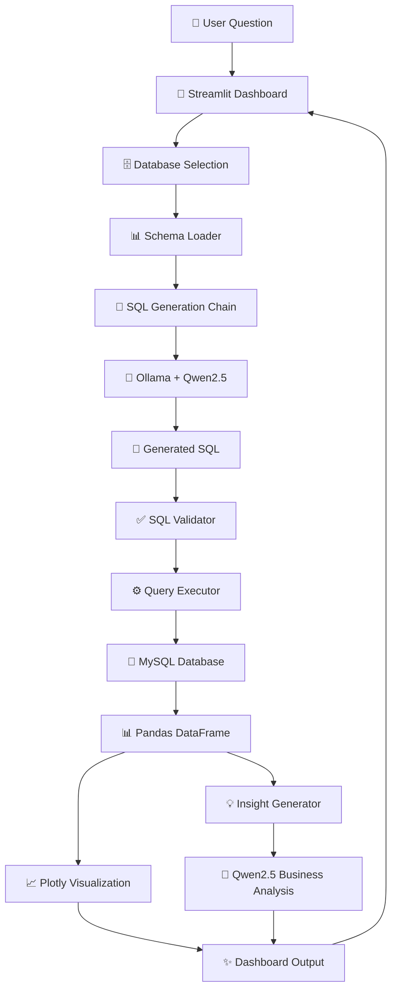

# 🚀 IntelliSQL AI

> **Stop writing SQL. Start asking questions.**

IntelliSQL AI is an LLM-powered Natural Language Analytics Platform that converts plain English questions into SQL queries, executes them against your database, visualizes the results, and generates AI-powered business insights.

Built using **LangChain**, **Ollama**, **Qwen2.5**, **MySQL**, **Streamlit**, and **Plotly**.

---

## ✨ Features

* 🤖 Natural Language → SQL Conversion
* 🧠 Schema-Aware Query Generation
* ✅ SQL Validation & Safety Checks
* 📊 Interactive Plotly Visualizations
* 💡 AI-Powered Business Insights
* 🗄️ Dynamic Database Selection
* ⚡ Local LLM Inference using Ollama
* 🔒 No External API Keys Required
* 🔄 OpenAI-Compatible Architecture

---

## 📸 Screenshots

### Query Result Dashboard


### Visualization and AI Insight


### Database Selector


---

## 🏗️ Architecture



---

## 🔄 Query Flow


---

## ✨ Highlights

* Converts natural language into executable SQL queries.
* Dynamically loads database schemas at runtime.
* Uses schema-aware prompting to reduce hallucinations.
* Validates generated SQL before execution.
* Generates interactive visualizations automatically.
* Produces AI-generated business insights from query results.
* Runs completely locally using Ollama and Qwen2.5.
* Designed to support OpenAI-compatible models with minimal configuration changes.

---

## 📂 Project Structure

```text
IntelliSQL-AI/
│
├── app/
│   ├── chains/
│   │   ├── sql_chain.py
│   │   └── insight_chain.py
│   │
│   ├── database/
│   │   ├── connection.py
│   │   ├── database_manager.py
│   │   ├── schema_loader.py
│   │   └── query_executor.py
│   │
│   ├── llm/
│   │   ├── ollama_client.py
│   │   └── prompts.py
│   │
│   └── services/
│       ├── chart_selector.py
│       ├── insight_generator.py
│       └── sql_validator.py
│
├── frontend/
│   ├── components/
│   ├── pages/
│   └── streamlit_app.py
│
├── data/
│   ├── schema.sql
│   └── seed_data.sql
│
├── tests/
│
├── .env.example
├── requirements.txt
└── README.md
```

---

## 🛠️ Tech Stack

### Frontend

* Streamlit

### LLM Layer

* Ollama
* Qwen2.5:3B
* LangChain

### Database Layer

* MySQL
* SQLAlchemy
* PyMySQL

### Analytics Layer

* Pandas
* NumPy

### Visualization

* Plotly

### Validation

* SQLGlot

---

## 📋 Prerequisites

Before running the project, install:

* Python 3.10+
* MySQL 8+
* Git
* Ollama

Download Ollama:

https://ollama.com

Verify installation:

```bash
ollama --version
```

---

## 🤖 Install Qwen Model

Pull the model:

```bash
ollama pull qwen2.5:3b
```

Verify:

```bash
ollama list
```

Start Ollama:

```bash
ollama serve
```

---

## ⚙️ Setup

### Clone Repository

```bash
git clone https://github.com/kulsharma11/IntelliSQL-AI.git

cd IntelliSQL-AI
```

### Create Virtual Environment

Windows:

```bash
python -m venv .venv

.venv\Scripts\activate
```

Linux / macOS:

```bash
python3 -m venv .venv

source .venv/bin/activate
```

### Install Dependencies

```bash
pip install -r requirements.txt
```

---

## 🗄️ Database Setup

Create database:

```sql
CREATE DATABASE analytics_db;
```

Import schema:

```bash
mysql -u root -p analytics_db < data/schema.sql
```

Import sample data:

```bash
mysql -u root -p analytics_db < data/seed_data.sql
```

---

## 🔑 Environment Variables

Create a `.env` file:

```env
MYSQL_HOST=127.0.0.1
MYSQL_PORT=3306
MYSQL_USER=root
MYSQL_PASSWORD=your_password

OLLAMA_MODEL=qwen2.5:3b
```

---

## ▶️ Run Application

Start Ollama:

```bash
ollama serve
```

Launch Streamlit:

```bash
streamlit run frontend/streamlit_app.py
```

Open:

```text
http://localhost:8501
```

---

## 💬 Example Questions

```text
Show all customers from North region

Show revenue by customer region

Show top 5 products by revenue

Show monthly revenue

Show revenue by product category

Show customers who signed up in 2024
```

---

## 🔒 Safety Features

* SQL validation using SQLGlot
* Schema-aware query generation
* Read-only analytics workflow
* Hallucination reduction through schema grounding
* Query execution safeguards

---

## 🚀 Future Enhancements

* Conversational analytics
* PostgreSQL support
* CSV / Excel ingestion
* Query history tracking
* Dashboard export
* Docker deployment
* OpenAI integration
* Multi-user authentication

---

## 📄 Resume Description

> Built an LLM-powered analytics platform that converts natural language into validated SQL queries, executes them against relational databases, and generates visualizations and business insights using LangChain, Ollama, Qwen2.5, Streamlit, Plotly, SQLAlchemy, and MySQL.

---

## 📜 License

MIT License

---

## ⭐ Support

If you found this project useful, consider giving it a star on GitHub.

**IntelliSQL AI — Convert Questions into Insights.**
